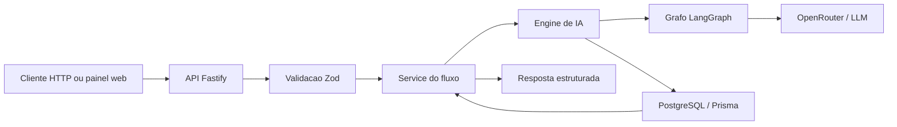

# Introducao

## Objetivo deste capitulo

Este capitulo apresenta o projeto desenvolvido para o case tecnico
CPJ-Cobranca AI em nivel executivo e tecnico. A ideia e deixar claro, desde o
inicio, que esta documentacao faz parte da entrega do case: ela explica o
contexto do desafio, a proposta da solucao, o que foi construido e por que as
decisoes tecnicas foram tomadas.

O objetivo e permitir que um avaliador entenda rapidamente qual problema foi
resolvido, qual solucao foi entregue, quais diferenciais tecnicos existem e por
onde continuar a leitura.

Esta introducao nao tenta explicar todos os detalhes internos. Arquitetura,
contratos de API, persistencia, deploy, testes e extensibilidade serao
detalhados nos proximos capitulos.

## Contexto do case

O projeto nasceu como resposta a um case tecnico com foco em cobranca,
automacao e uso pratico de IA no ciclo de desenvolvimento. Em vez de entregar
apenas um prototipo pontual, a proposta foi construir uma base de produto
avaliavel: API, persistencia, agentes, painel web, documentacao interativa,
Docker, testes e caminhos claros de evolucao.

Nesse contexto, o CPJ-Cobranca AI e uma solucao para apoiar atividades
tecnicas relacionadas a analise de codigo, aderencia a requisitos,
documentacao, geracao de testes e revisao de Pull Requests com auxilio de
agentes de IA.

O nome do projeto reflete o objetivo do case: criar uma ferramenta aplicavel ao
ambiente CPJ-Cobranca, onde revisoes, documentacao, verificacao de regras e
qualidade tecnica podem ser aceleradas por fluxos automatizados, mas ainda
mantendo rastreabilidade para avaliacao humana.

Em vez de tratar a IA como uma chamada isolada de chat, o projeto organiza cada
capacidade em fluxos especializados. Esses fluxos combinam validacao de
contratos, ferramentas deterministicas, prompts versionados, modelos
configuraveis, grafos LangGraph, persistencia de historico, telemetria e uma
interface web para acompanhamento operacional.

O resultado e uma API pronta para avaliacao tecnica, acompanhada por um painel
administrativo Next.js e por uma estrutura de execucao local ou conteinerizada.

## O que o case pedia

O enunciado do case solicitava a construcao de um microservico backend
containerizado, com API REST, capaz de expor um agente de IA para automatizar
quatro fluxos do processo de desenvolvimento do CPJ-Cobranca.

Os quatro fluxos obrigatorios eram:

- **Code Review Automatizado**: endpoint `POST /api/v1/review`, recebendo um
  trecho de codigo, linguagem e contexto opcional, e retornando qualidade geral,
  nota, problemas encontrados, pontos positivos e resumo.
- **Avaliacao de Aderencia a Tarefa**: endpoint `POST /api/v1/compliance`,
  cruzando uma descricao de tarefa com o codigo implementado para apontar
  requisitos atendidos, ausentes e parcialmente atendidos.
- **Geracao de Documentacao Tecnica**: endpoint `POST /api/v1/document`,
  gerando documentacao tecnica ou operacional a partir de codigo informado.
- **Geracao de Testes Unitarios**: endpoint `POST /api/v1/tests`, produzindo
  casos de teste, dicas de cobertura e o conteudo completo de um arquivo de
  teste.

Tambem eram obrigatorios endpoints auxiliares para operacao e rastreabilidade:

- `GET /health`, para healthcheck da aplicacao;
- `GET /api/v1/history`, para listar as ultimas execucoes;
- `GET /api/v1/history/{id}`, para consultar o resultado completo de uma
  execucao especifica.

Do ponto de vista tecnico, o case exigia:

- persistencia das execucoes do agente em banco de dados;
- integracao com algum provedor LLM, documentando modelo, configuracao e custo
  estimado quando aplicavel;
- Dockerfile, `docker-compose.yml` e `.env.example`;
- subida da aplicacao com `docker compose up --build`;
- documentacao clara de setup, variaveis de ambiente e exemplos funcionais;
- repositorio publico com codigo-fonte, configuracao Docker e colecao de
  exemplos via Postman, Insomnia ou arquivo `.http`.

O README tambem era parte central da entrega. O enunciado pedia que ele
explicasse decisoes tecnicas, instrucoes de execucao com Docker, configuracao de
ambiente, exemplos completos de request e response para cada fluxo, diferenciais
implementados e o que seria feito com mais tempo.

## Criterios de avaliacao do case

O case definia avaliacao de 1 a 5 em cada criterio, com pesos diferentes:

| Criterio | Peso | O que era avaliado |
| --- | ---: | --- |
| Funcionalidade | 25% | Quatro fluxos funcionando, Docker subindo e endpoints respondendo corretamente. |
| Qualidade do agente / IA | 25% | Qualidade dos prompts, utilidade real das saidas e tratamento de falhas do LLM. |
| Qualidade do codigo | 20% | Organizacao, legibilidade, separacao de responsabilidades e consistencia. |
| README e documentacao | 15% | Clareza, decisoes justificadas e exemplos que realmente funcionam. |
| Persistencia e modelagem | 10% | Schema adequado, queries corretas e dados consistentes. |
| Diferenciais implementados | 5% | Qualidade e utilidade dos itens extras escolhidos. |

O enunciado deixava claro que uma solucao simples, legivel e funcional teria
mais valor do que uma arquitetura sofisticada que nao subisse ou que nao tivesse
instrucoes de uso confiaveis. Tambem valorizava a forma de pensar, documentar,
comunicar trade-offs e construir algo realista com IA.

Entre os diferenciais sugeridos estavam LangGraph ou LangChain, prompt
templating estruturado, cache por hash, logs estruturados, tracing com
LangSmith, batch, streaming via Server-Sent Events, webhook callback, testes
automatizados e validacao de schema na entrada e na saida.

## Problema resolvido

Atividades como revisar codigo, verificar se uma entrega atende uma tarefa,
gerar documentacao ou sugerir testes costumam depender de leitura manual,
criterios pouco padronizados e conhecimento disperso entre pessoas do time.

O projeto resolve esse problema criando uma camada automatizada e rastreavel
para apoiar essas decisoes. A API recebe codigo, contexto ou dados de Pull
Request, executa um fluxo especializado e devolve uma resposta estruturada que
pode ser armazenada, revisada, auditada e comparada depois.

Essa abordagem ajuda em quatro pontos principais:

- padronizar analises tecnicas com contratos previsiveis;
- reduzir trabalho repetitivo de revisao, documentacao e testes;
- registrar historico, steps, modelo usado, tokens e custos;
- permitir evolucao controlada de prompts, modelos e agentes.

## Visao geral da solucao

A solucao e composta por duas partes principais:

- **API backend**: aplicacao Node.js com TypeScript e Fastify, responsavel por
  expor endpoints HTTP, validar payloads, executar fluxos de IA, persistir
  historico e disponibilizar documentacao OpenAPI.
- **Painel web admin**: aplicacao Next.js em `apps/web`, usada para acompanhar
  historico, prompts, modelos, status da API, custos, tokens e execucao guiada
  dos fluxos.

O backend usa PostgreSQL via Prisma para persistir execucoes, steps,
telemetria, prompts versionados, catalogo de modelos e resumos de batch. Os
fluxos de IA usam LangGraph.js e LangChain.js com OpenRouter como provedor LLM.
LangSmith pode ser ativado opcionalmente para tracing.

## Capacidades entregues

O projeto entrega os seguintes fluxos e recursos:

- `review`: revisao de codigo multi-linguagem para TypeScript, JavaScript,
  Python e PHP.
- `review/stream`: revisao de codigo com Server-Sent Events para acompanhar a
  execucao em tempo real.
- `review/pull-request`: revisao de Pull Request no GitHub, com padroes de
  codigo, seguranca, consistencia de projeto e criterios Jira opcionais.
- `compliance`: avaliacao de aderencia entre descricao da tarefa e codigo
  implementado.
- `document`: geracao de documentacao tecnica ou operacional a partir de
  codigo.
- `tests`: geracao de estrategia, casos e arquivo de testes.
- `tests/pull-request`: geracao de testes unitarios baseada nas funcoes e
  trechos criticos alterados em um Pull Request.
- `batch`: execucao sequencial de multiplos fluxos em uma unica requisicao.
- `history`: consulta das execucoes persistidas, incluindo detalhes e steps.
- `analytics`: visao agregada de uso, tokens e custos.
- `prompts`: cadastro, consulta e ativacao de versoes de prompt por fluxo.
- `models`: cadastro, ativacao e selecao de modelo padrao global.
- `webhook`: callback opcional ao finalizar fluxos principais.
- `OpenAPI/Swagger`: documentacao interativa em `/docs`.

## Como a solucao funciona em alto nivel

O fluxo padrao segue esta sequencia conceitual:

Em termos praticos, uma request entra pela API, e validada pelos contratos
compartilhados, passa pelo service do modulo correspondente e chega ao engine do
fluxo. O engine resolve prompt e modelo, verifica cache quando aplicavel,
executa o grafo LangGraph, persiste o resultado, registra telemetria e retorna
um JSON estruturado.

## Principais diferenciais tecnicos

O case vai alem de um endpoint simples chamando um modelo de linguagem. Os
principais diferenciais sao:

- **Arquitetura modular**: cada fluxo possui controllers, routes, services,
  engines, graphs, agents, prompts e tools separados por responsabilidade.
- **Contratos estruturados**: entradas e saidas usam schemas compartilhados,
  reduzindo ambiguidade entre API, agentes, testes e painel web.
- **Grafos de agentes**: LangGraph organiza etapas observaveis, incluindo
  roteamento por linguagem, tools deterministicas, agentes especialistas e
  agregacao.
- **Persistencia completa**: historico, steps, telemetria, custos, tokens,
  cache e batch ficam registrados em PostgreSQL.
- **Governanca de IA**: prompts e modelos nao ficam apenas hardcoded; podem ser
  versionados, ativados e sobrescritos por request.
- **Operacao local e conteinerizada**: Docker Compose sobe API, banco e painel
  web, aplicando migrations e seed antes do start da API.
- **Avaliabilidade**: a solucao tem testes automatizados, OpenAPI, exemplos
  HTTP e comandos de verificacao para facilitar revisao tecnica.

## Leitura rapida para avaliacao

Para avaliar o projeto rapidamente, a ordem recomendada e:

1. Ler este capitulo para entender o contexto e os diferenciais.
2. Abrir `02-escopo-funcional.md` para ver tudo que foi entregue.
3. Ler `04-arquitetura.md` e `05-fluxos-de-ia-e-agentes.md` para entender as
   decisoes centrais.
4. Usar `10-como-rodar.md` para executar localmente.
5. Consultar `12-testes-validacao.md` para validar a entrega.

Enquanto os capitulos seguintes ainda nao forem escritos, o README raiz e a
documentacao OpenAPI em `/docs` continuam sendo as referencias praticas para
execucao e contratos.

## Proximo capitulo

O proximo documento planejado e `02-escopo-funcional.md`, que detalhara o que
cada fluxo faz, quais recursos estao implementados e quais responsabilidades
ficam fora do escopo atual.
