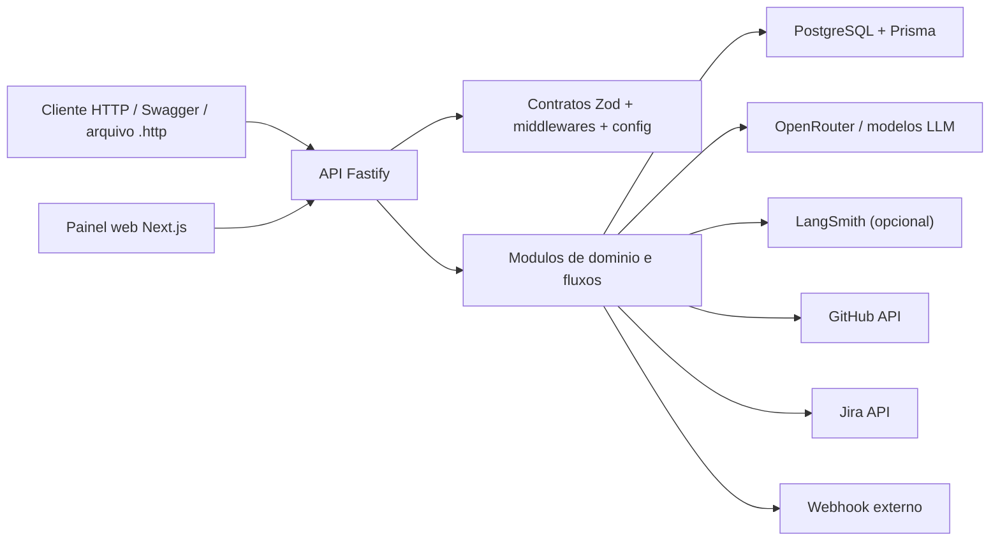
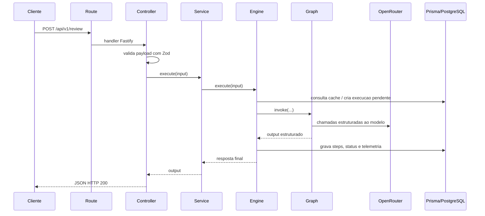
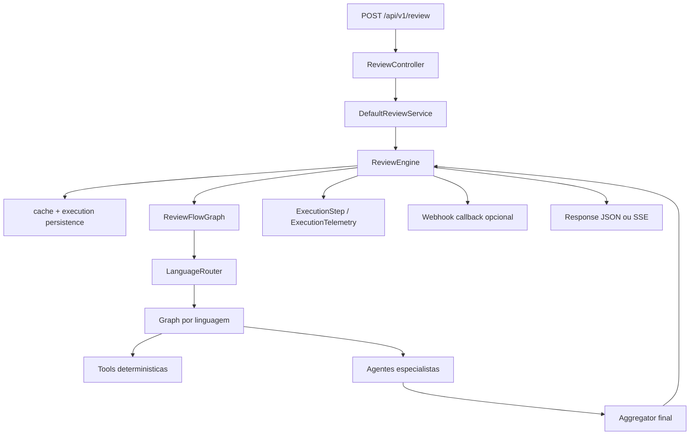

# Arquitetura

## Objetivo deste capitulo

Este capitulo descreve como o projeto foi organizado internamente para atender
o case tecnico do CPJ-Cobranca AI. O foco aqui e mostrar a estrutura do sistema
como arquitetura de software: camadas, modulos, fluxo de uma request,
responsabilidades e pontos de integracao.

O objetivo nao e detalhar cada algoritmo ou cada prompt. A ideia e permitir que
um avaliador tecnico entenda rapidamente:

- como a aplicacao sobe;
- como as dependencias sao montadas;
- como os fluxos foram separados;
- como a API conversa com banco, LLM e painel web;
- onde estao os principais pontos de extensao e rastreabilidade.

## Visao arquitetural

Em alto nivel, a solucao e composta por quatro blocos principais:

- **cliente**: consumidores HTTP e painel web;
- **API backend**: camada principal de orquestracao e execucao dos fluxos;
- **persistencia**: PostgreSQL via Prisma para historico, telemetria, prompts,
  modelos e batch;
- **integracoes externas**: OpenRouter, LangSmith opcional, GitHub, Jira e
  webhook callback.

## Principio estrutural da arquitetura

A arquitetura foi desenhada para equilibrar tres necessidades do case:

- **clareza para avaliacao tecnica**;
- **separacao de responsabilidades**;
- **entrega real, rodavel e extensivel**.

Por isso, o projeto nao foi modelado como um unico servico chamando LLM de
forma direta. Em vez disso, cada capacidade foi organizada em modulos com
fronteiras claras, contratos compartilhados e uma camada de engine responsavel
por executar o fluxo real.

## Camadas da aplicacao

### 1. Entrada e composicao

Os arquivos `src/server.ts` e `src/app.ts` sao o ponto de entrada da
aplicacao.

Nessa camada acontecem quatro coisas principais:

- carregamento de variaveis de ambiente;
- criacao da instancia Fastify;
- registro de plugins e middlewares globais;
- registro das rotas por modulo.

Essa decisao centraliza o bootstrap e evita espalhar configuracao critica pelo
projeto.

### 2. Shared

O diretorio `src/shared/` concentra tudo o que atravessa varios modulos:

- `config/`: leitura e validacao de ambiente;
- `contracts/`: schemas Zod e tipos compartilhados;
- `middlewares/`: tratamento global de erro, contexto de request e seguranca;
- `utils/`: hash, datas e retry compartilhado.

Essa camada existe para evitar duplicacao e manter consistencia entre rotas,
servicos, testes e documentacao.

### 3. Infrastructure

O diretorio `src/infrastructure/` concentra integracoes transversais que nao
pertencem a um fluxo especifico:

- `database/`: plugin Prisma para o Fastify;
- `logging/`: configuracao de logger;
- `openapi/`: registro de Swagger/OpenAPI;
- `errors/`: tratamento e normalizacao de erros.

E uma camada de apoio tecnico. Ela sustenta a API, mas nao concentra regra de
negocio nem detalhes funcionais dos fluxos.

### 4. Modules

O diretorio `src/modules/` concentra os blocos funcionais reais do sistema.

Ele foi dividido em dois grandes grupos:

- **modulos de fluxo**: `review`, `compliance`, `document`, `tests`, `batch`;
- **modulos de apoio e governanca**: `history`, `analytics`, `prompts`,
  `models`, `executions`, `agent`.

Essa divisao ajuda a separar:

- o que entrega valor funcional direto ao case;
- o que viabiliza rastreabilidade, configuracao e observabilidade.

## Organizacao por modulo

Cada modulo segue, em maior ou menor grau, o mesmo padrao estrutural:

- `routes/`: registra endpoints Fastify;
- `controllers/`: recebe request, valida payload e envia response;
- `services/`: coordena o uso do fluxo a partir da perspectiva HTTP;
- `engines/`: executa a logica principal do fluxo;
- `graphs/`: define orquestracao em LangGraph quando aplicavel;
- `agents/`: encapsula especialistas baseados em LLM;
- `tools/`: validacoes ou analises deterministicas;
- `prompts/`: catalogos e templates de prompt;
- `docs/`: schemas OpenAPI por rota.

Nem todo modulo possui todas essas pastas, mas o padrao geral se repete.

## Fluxo de uma request

O ciclo de request segue uma sequencia clara da borda HTTP ate a persistencia e
o retorno estruturado.

Esse fluxo tambem ajuda a entender uma decisao importante da arquitetura: o
controller nao conhece detalhes de LLM, banco ou grafo. Ele apenas recebe,
valida e delega.

## Papel de cada camada no request lifecycle

### Routes

As rotas fazem a ligacao entre a URL HTTP e o controller correspondente.
Tambem registram schemas OpenAPI e configuracoes do Fastify, como `attachValidation`.

Exemplo concreto: `src/modules/review/routes/index.ts`

### Controllers

Os controllers transformam a request HTTP em chamada de aplicacao. Eles:

- parseiam e validam payloads;
- convertem erro de validacao em resposta apropriada;
- chamam o service correto;
- entregam a resposta HTTP final.

Exemplo concreto: `src/modules/review/controllers/index.ts`

### Services

Os services funcionam como fachada do fluxo para a camada HTTP. Eles escolhem
qual engine usar, resolvem modo de execucao especial quando necessario e
expõem uma interface mais simples para o controller.

No caso de `review`, por exemplo, o service tambem trata o modo streaming SSE
sem jogar essa responsabilidade para o engine inteiro.

### Engines

Os engines sao o centro operacional dos fluxos. Eles concentram:

- verificacao de cache;
- criacao de execucao pendente;
- chamada do grafo principal;
- marcacao de sucesso ou falha;
- gravacao de steps e telemetria;
- notificacao de webhook quando configurado.

Exemplo concreto: `src/modules/review/engines/review.engine.ts`

### Graphs

Os graphs modelam a orquestracao do fluxo. Eles existem porque varios fluxos de
IA nao sao apenas uma chamada unica ao modelo: ha selecao de caminho,
ferramentas deterministicas, agentes especialistas e agregacao.

Essa camada e especialmente importante no `review`, que possui:

- roteamento por linguagem;
- grafos especificos por linguagem;
- especialistas por criterio de avaliacao;
- aggregator final.

### Agents e tools

Os agents encapsulam especialistas baseados em LLM. As tools executam analises
deterministicas que complementam ou guiam o fluxo.

Essa combinacao foi escolhida para evitar depender 100% de comportamento livre
do modelo. A arquitetura mistura heuristicas previsiveis com analise generativa.

## Dependencias e composicao

A composicao principal acontece em `App`, mas cada modulo tambem sabe criar suas
proprias dependencias padrao quando recebe um `FastifyInstance` com Prisma
registrado.

Isso gera um modelo leve de injecao de dependencias:

- no runtime real, as rotas constroem services e repositories concretos;
- em testes, as dependencias podem ser injetadas manualmente;
- a aplicacao continua simples, sem precisar de um container DI pesado.

Esse padrao aparece com clareza em
`src/modules/review/routes/index.ts`,
onde o modulo cria `DefaultReviewService`, `ReviewExecutionRepository`,
`DefaultPromptsService` e `DefaultModelsService` quando necessario.

## Persistencia na arquitetura

A persistencia foi desenhada como parte estrutural da solucao, nao como detalhe
acoplado ao fim do fluxo.

O schema Prisma guarda:

- `Execution`: execucao principal do fluxo;
- `ExecutionStep`: steps intermediarios;
- `ExecutionTelemetry`: uso de modelo, tokens e custo;
- `PromptVersion`: versoes de prompt por fluxo e bloco;
- `RegisteredModel` e `GlobalModelSettings`: governanca de modelos;
- `BatchExecution`: resumo de execucoes em lote.

Essa modelagem deixa a arquitetura mais auditavel e explica por que a aplicacao
nao trata cada resposta do LLM como algo descartavel.

## Arquitetura do review como exemplo de referencia

O fluxo `review` e o melhor exemplo para entender a arquitetura inteira, porque
ele exercita quase todos os componentes do sistema ao mesmo tempo.

Essa estrutura se repete, com variacoes menores, em `compliance`, `document` e
`tests`.

## Arquitetura do painel web

O frontend em `apps/web` nao replica a logica dos fluxos. Ele funciona como
cliente da API.

Em termos arquiteturais, isso e importante porque preserva uma separacao clara:

- a API e a fonte de verdade funcional;
- o painel e uma camada de operacao e visualizacao.

Isso reduz duplicacao de regra e evita que parte da logica do case fique
espalhada entre backend e frontend.

## Middlewares e preocupacoes transversais

Algumas responsabilidades aparecem em toda a aplicacao e por isso foram
centralizadas em middlewares e infraestrutura compartilhada:

- tratamento global de erros;
- contexto de request;
- seguranca HTTP;
- OpenAPI/Swagger;
- logger;
- conexao Prisma.

Esse desenho evita repetir setup tecnico em cada modulo e ajuda a manter a
arquitetura coesa.

## Por que essa arquitetura funciona bem para o case

Esta arquitetura foi uma boa escolha para o case por cinco motivos:

1. deixa o bootstrap simples e facil de auditar;
2. separa HTTP, execucao de fluxo, persistencia e integracoes externas;
3. permite testes por camada;
4. acomoda bem fluxos com IA sem reduzir tudo a uma unica chamada de prompt;
5. cria base real para evolucao futura sem inflar demais a entrega.

## Limites assumidos na arquitetura atual

A arquitetura foi pensada para uma entrega de case e, por isso, assume alguns
limites conscientes:

- nao ha mensageria externa nem fila dedicada;
- os fluxos rodam de forma sincrona no backend principal;
- nao existe separacao por microservicos;
- o painel web depende integralmente da API para dados operacionais;
- o modelo de injecao de dependencias e manual, e nao baseado em framework DI.

Esses limites nao empobrecem a entrega. Eles mantem a solucao legivel,
demonstravel e suficiente para o escopo pedido.

## Relacao com os proximos capitulos

Depois deste capitulo, os proximos documentos aprofundam dois pontos
especificos desta arquitetura:

- `05-fluxos-de-ia-e-agentes.md`: detalha graphs, tools, especialistas e
  aggregator;
- `07-dados-cache-telemetria.md`: detalha a modelagem persistida no banco.
