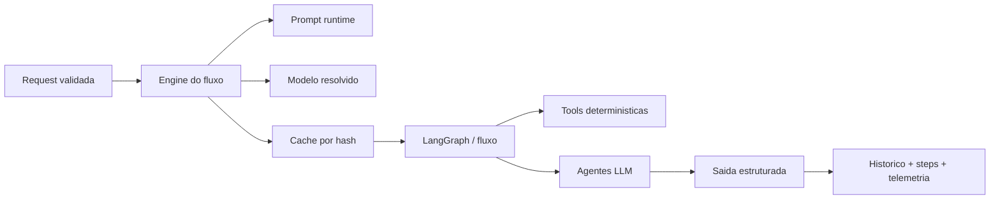
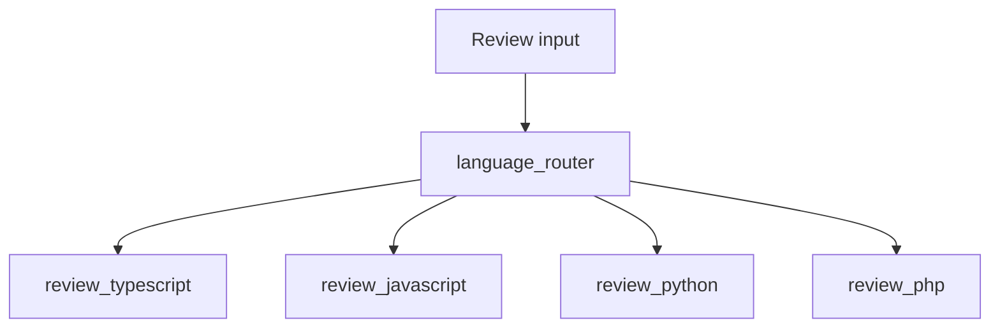
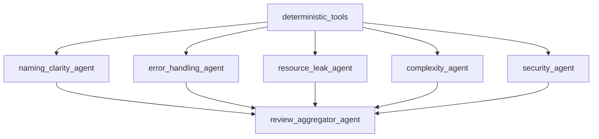
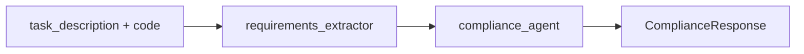
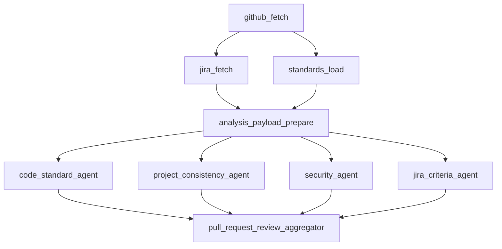
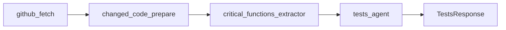

# Fluxos de IA e Agentes

## Objetivo deste capitulo

Este capitulo detalha como os fluxos de IA funcionam dentro do projeto. O foco
nao e apenas dizer que a API "chama um modelo", mas explicar como a aplicacao
combina:

- tools deterministicas;
- prompts versionados;
- agentes especialistas;
- structured output;
- grafos LangGraph;
- persistencia de steps;
- telemetria e retry.

Esse e o coracao tecnico da entrega, porque e aqui que a solucao deixa de ser
um wrapper simples de LLM e passa a operar como um conjunto de fluxos
especializados.

## Visao geral dos fluxos

Os fluxos com IA do projeto podem ser lidos em tres grupos:

- **fluxo de review**, que e o mais rico e usa roteamento por linguagem,
  especialistas e aggregator;
- **fluxos lineares**, como `compliance`, `document` e `tests`, que seguem a
  ideia tool -> agente;
- **fluxos de Pull Request**, que combinam integracoes externas, preparacao de
  payload e avaliacao estruturada.

## Padrao geral de execucao

Apesar das diferencas entre os fluxos, existe um padrao arquitetural comum:

1. a request entra pelo controller e chega ao service;
2. o engine resolve prompt e modelo;
3. o engine consulta cache quando aplicavel;
4. o grafo executa steps deterministicos e/ou agentes LLM;
5. as respostas retornam em formato estruturado;
6. o engine persiste status, steps, telemetria e callback de webhook;
7. a API devolve o resultado final.

## Structured output como base do comportamento

Um dos pilares da solucao e o uso de saida estruturada em vez de respostas
textuais livres. A classe `src/modules/agent/llm/structured-output.runner.ts`
faz esse papel.

Na pratica, isso significa que cada agente ou aggregator:

- recebe mensagens `system` e `user`;
- responde segundo um schema Zod esperado;
- passa por validacao antes de a resposta seguir no fluxo.

Essa escolha reduz ambiguidades, melhora a confiabilidade da API e faz com que
os contratos dos endpoints conversem melhor com testes, OpenAPI e persistencia.

## Tools deterministicas versus agentes LLM

O projeto nao delega tudo ao modelo. Ele combina duas categorias de execucao:

### Tools deterministicas

As tools sao responsaveis por sinais objetivos e previsiveis. Elas rodam sem
LLM e normalmente operam com heuristicas, regexes ou analise simples do input.

Exemplo no review:

- detecao de logs com dados sensiveis;
- detecao de interpolacao SQL evidente.

Exemplo em outros fluxos:

- extracao de requisitos em `compliance`;
- sinais de API publica em `document`;
- candidatos de comportamento em `tests`.

### Agentes LLM

Os agentes entram quando a tarefa exige interpretacao, consolidacao de contexto
ou julgamento tecnico mais semantico.

Eles recebem:

- o input original;
- o contexto da linguagem;
- os achados das tools;
- o prompt do bloco correspondente.

Essa divisao e importante porque evita tratar o LLM como oraculo absoluto.

## Fluxo de review

O fluxo `review` e o mais completo do sistema e funciona como referencia para o
resto da arquitetura de IA.

### Etapa 1: roteamento por linguagem

O `ReviewFlowGraph` recebe a request e primeiro passa pelo node
`language_router`.

Essa etapa identifica a linguagem do input e direciona para um dos grafos
especificos:

- `review_typescript`
- `review_javascript`
- `review_python`
- `review_php`

Isso permite adequar perfis, contexto e leitura do codigo sem misturar regras
de linguagens diferentes em um unico fluxo generico.

### Etapa 2: tools deterministicas

Dentro do grafo da linguagem, o primeiro passo e `deterministic_tools`.

Esse passo gera achados objetivos que depois alimentam os agentes
especialistas. Em vez de pedir ao LLM que redescubra tudo do zero, a aplicacao
ja entrega parte do terreno preparado.

### Etapa 3: especialistas paralelos

Depois das tools, o fluxo dispara especialistas independentes:

- `naming_clarity_agent`
- `error_handling_agent`
- `resource_leak_agent`
- `complexity_agent`
- `security_agent`

Cada um recebe o mesmo contexto base, mas com uma missao diferente.

Essa abordagem traz duas vantagens:

- reduz a chance de uma resposta unica ignorar dimensoes importantes;
- deixa a analise mais observavel e modular.

### Etapa 4: aggregator final

O `review_aggregator_agent` recebe:

- codigo original;
- contexto opcional do usuario;
- achados deterministicos;
- saidas dos especialistas.

Ele e responsavel por produzir a resposta final do endpoint, no schema
`ReviewResponse`.

Esse aggregator nao repete simplesmente os especialistas. Ele consolida,
remove redundancia, organiza severidades e constrói um parecer unico.

## Prompts no review

O review usa multiplos blocos de prompt:

- um por especialista;
- um para o aggregator.

Esses blocos podem vir de duas fontes:

- conjunto versionado armazenado no banco;
- fallback legado em catalogos locais quando nao ha resolver persistido.

Isso permite ajustar comportamento dos especialistas sem precisar alterar toda a
estrutura do fluxo.

## Fluxos lineares: compliance, document e tests

Os fluxos `compliance`, `document` e `tests` seguem uma estrategia mais simples
do que o review. Em todos eles, o padrao geral e:

- uma tool prepara sinais ou estrutura parcial;
- um agente LLM gera a resposta final.

### Compliance

O `ComplianceFlowGraph` roda:

1. `requirements_extractor`
2. `compliance_agent`

O primeiro passo extrai requisitos e sinais relevantes; o segundo cruza isso
com o codigo e produz score, requisitos cobertos, faltantes e parciais.

### Document

O `DocumentFlowGraph` roda:

1. `document_signal_extractor`
2. `document_agent`

Aqui a tool tenta identificar candidatos de API publica, sinais de entrada,
saida e comportamento, e o agente monta a documentacao final.

### Tests

O `TestsFlowGraph` roda:

1. `tests_signal_extractor`
2. `tests_agent`

Nesse caso, a tool destaca comportamentos, caminhos e sinais que merecem teste,
e o agente devolve o arquivo de testes, casos cobertos e dicas de cobertura.

## Fluxo de review de Pull Request

O fluxo `review/pull-request` amplia o modelo tradicional de review para um
cenario de repositorio real.

Ele combina:

- busca de dados no GitHub;
- busca opcional no Jira;
- carga de padroes locais do projeto;
- preparacao de payload truncado;
- analise por secoes;
- decisao agregada final.

### Etapas do fluxo

### O que esse fluxo ganha com isso

- o review deixa de olhar apenas um trecho solto de codigo;
- o diff e analisado com contexto de projeto;
- ha cruzamento com criterios de Jira quando informados;
- o sistema retorna secoes distintas e um veredito consolidado.

O node `jira_criteria_agent` pode ser marcado como `skipped` quando nao existe
`jira_issue_key`, o que mantem o fluxo deterministico sem forcar uma integracao
obrigatoria.

## Fluxo de testes por Pull Request

O fluxo `tests/pull-request` tambem usa GitHub como fonte, mas com objetivo
diferente: gerar testes focados nas alteracoes mais criticas do diff.

### Etapas do fluxo

### Comportamentos relevantes

Esse fluxo:

- infere a linguagem principal pelos arquivos alterados;
- trunca payloads grandes para caber no contexto do modelo;
- extrai funcoes, classes, branches e casos de erro criticos;
- usa esse material para orientar a geracao do arquivo de teste final.

Ou seja: nao e apenas "gerar teste para um PR". Existe uma etapa intermediaria
de preparacao e priorizacao do que realmente merece cobertura.

## Retry com backoff nas chamadas de IA e integracoes

As chamadas externas nao dependem de tentativa unica. O projeto aplica retry
configuravel com backoff em pontos como:

- execucoes LLM via `LangChainStructuredOutputRunner`;
- telemetria/precos do OpenRouter;
- GitHub;
- Jira;
- webhook callback.

Isso melhora resiliencia para falhas transitorias sem poluir cada fluxo com
logica repetida de repeticao manual.

## Telemetria dos fluxos

Os fluxos com LLM usam `AgentTelemetryCollector` para acumular dados de uso de
modelo ao longo da execucao.

Ao final, o engine pode persistir:

- provider;
- modelo solicitado;
- modelo realmente usado;
- generation ids;
- tokens de entrada e saida;
- custo total, entrada e saida;
- cache read tokens.

Essa camada e importante porque transforma o uso do LLM em algo mensuravel, e
nao apenas observavel por texto de log.

## Steps persistidos como trilha de execucao

Cada grafo registra steps intermediarios quando existe `executionId` e
`stepRecorder` disponiveis.

Isso significa que a aplicacao guarda nao apenas o resultado final, mas tambem
etapas como:

- `language_router`
- `deterministic_tools`
- `security_agent`
- `review_aggregator_agent`
- `github_fetch`
- `analysis_payload_prepare`
- `tests_signal_extractor`

Esse desenho melhora muito a auditabilidade do case e ajuda a explicar a
resposta final com mais precisao.

## Webhook e camada de engine

Os grafos cuidam da execucao interna do fluxo. Ja o engine fica responsavel por
atividades transversais ao redor dele:

- cache;
- persistencia de execucao;
- mark success / failed;
- telemetria agregada;
- webhook callback.

Isso e importante arquiteturalmente porque evita misturar detalhes de entrega
externa dentro dos nodes do grafo.

## Diferenca entre grafo e engine

Vale registrar de forma bem objetiva:

- **grafo**: descreve como o fluxo pensa;
- **engine**: descreve como o fluxo opera dentro da aplicacao.

O grafo decide etapas, especialistas, tools e agregacao. O engine decide cache,
persistencia, telemetria, webhook e integracao com o ciclo de execucao da API.

## Por que essa abordagem faz sentido no case

Essa modelagem foi uma boa escolha para o case porque:

1. evita endpoints opacos demais;
2. permite explicar o comportamento dos agentes com clareza;
3. melhora testabilidade por step e por fluxo;
4. cria base para evoluir prompts, modelos e nodes sem reescrever tudo;
5. entrega algo mais proximo de um sistema de IA operacional do que de um
   prototipo isolado.

## Relacao com os proximos capitulos

Depois deste capitulo, a leitura natural e:

- `06-api-contratos-e-exemplos.md`, para ver como esses fluxos aparecem nos
  endpoints;
- `07-dados-cache-telemetria.md`, para entender como cache, steps e telemetria
  ficam persistidos;
- `08-prompts-modelos-governanca.md`, para detalhar como prompts e modelos sao
  resolvidos em runtime.
