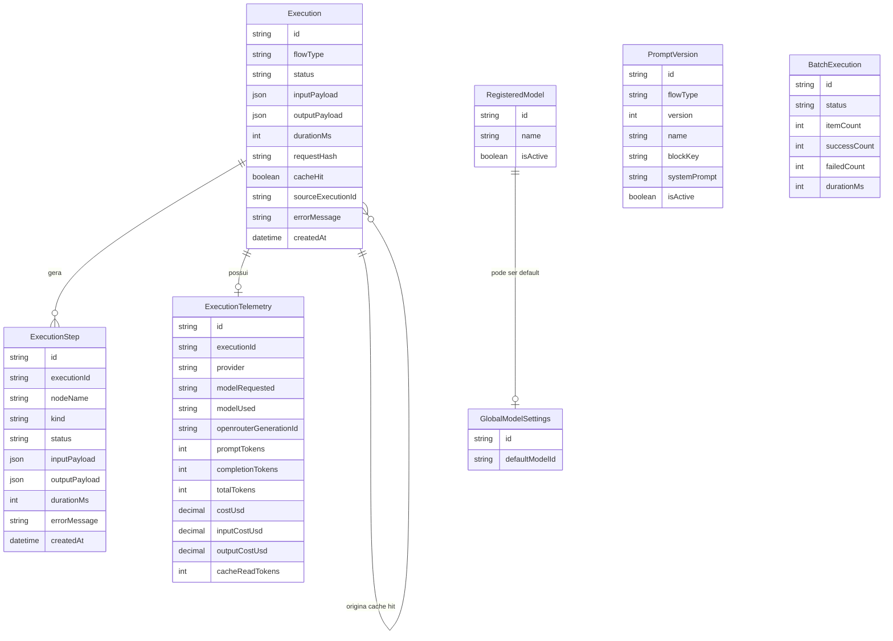

# Dados, Cache e Telemetria

## Objetivo deste capitulo

Este capitulo explica como a aplicacao persiste execucoes, steps, telemetria,
prompts, modelos e resumos de batch.

O objetivo e mostrar que a solucao nao trata o uso de IA como algo efemero.
Cada execucao importante deixa rastros que podem ser consultados, agregados e
auditados depois.

## Visao geral da persistencia

O projeto usa PostgreSQL com Prisma e concentra a modelagem principal em:

- `Execution`
- `ExecutionStep`
- `ExecutionTelemetry`
- `PromptVersion`
- `RegisteredModel`
- `GlobalModelSettings`
- `BatchExecution`

Essa estrutura atende quatro necessidades centrais do case:

- historico rastreavel;
- governanca de prompts;
- governanca de modelos;
- medicao de custo e uso.

## Diagrama de entidades

## Execucoes de fluxo

### Tabela `Execution`

`Execution` e o registro central de uma execucao.

Campos principais:

- `flowType`: qual fluxo rodou;
- `status`: `pending`, `success` ou `failed`;
- `inputPayload`: payload original;
- `outputPayload`: resposta final quando houver sucesso;
- `durationMs`: duracao total;
- `requestHash`: hash usado para cache;
- `cacheHit`: indica reaproveitamento;
- `sourceExecutionId`: aponta para a execucao fonte em caso de cache hit;
- `errorMessage`: mensagem final de falha, quando existir.

### Fluxos registrados

O enum `ExecutionFlowType` cobre:

- `review`
- `compliance`
- `document`
- `tests`
- `batch`
- `pull_request_review`

Isso deixa claro que a persistencia cobre tanto os fluxos obrigatorios quanto
alguns diferenciais relevantes.

## Steps de execucao

### Tabela `ExecutionStep`

`ExecutionStep` registra o caminho interno de cada execucao.

Campos principais:

- `nodeName`
- `kind`
- `status`
- `inputPayload`
- `outputPayload`
- `durationMs`
- `errorMessage`

### Tipos de step

O enum `ExecutionStepKind` inclui:

- `system`
- `tool`
- `prompt`
- `llm`
- `parser`
- `persistence`
- `webhook`
- `cache`

Na pratica, isso permite diferenciar:

- uma etapa de orquestracao;
- uma tool deterministica;
- uma chamada a agente LLM;
- uma etapa de webhook;
- um cache hit ou cache lookup.

## Telemetria de uso e custo

### Tabela `ExecutionTelemetry`

`ExecutionTelemetry` guarda metadados de consumo do provedor LLM.

Campos principais:

- `provider`
- `modelRequested`
- `modelUsed`
- `openrouterGenerationId`
- `promptTokens`
- `completionTokens`
- `totalTokens`
- `costUsd`
- `inputCostUsd`
- `outputCostUsd`
- `cacheReadTokens`

Essa estrutura permite responder perguntas como:

- quanto um fluxo consumiu;
- qual modelo foi usado de fato;
- quanto custou uma execucao;
- quanto do uso veio de leitura de cache do provider.

## Como cache funciona

O cache e baseado em hash do payload de entrada.

### Logica geral

1. o engine calcula `requestHash`;
2. procura uma execucao anterior com mesmo hash e status `success`;
3. se encontrar, cria uma nova execucao marcada com `cacheHit=true`;
4. essa nova execucao aponta para a original em `sourceExecutionId`.

### Por que criar nova execucao em cache hit

Essa escolha e importante porque preserva rastreabilidade de uso real.

Sem isso, haveria duas perdas:

- a API devolveria uma resposta sem registrar que aquela chamada aconteceu;
- analytics e historico subestimariam o uso do sistema.

Com o modelo atual, existe reaproveitamento de resultado sem perder trilha
operacional.

## Relacao pai-filho no cache

A auto-relacao em `Execution` permite ligar:

- uma execucao fonte;
- varias execucoes filhas reaproveitando aquele resultado.

Isso e particularmente util em cenarios de batch, demonstracao repetida ou uso
intensivo do mesmo input.

## Historico exposto pela API

O historico publico nao retorna o schema Prisma cru. Ele passa por mapeamento
para contratos HTTP mais amigaveis.

Exemplos de transformacao:

- `flowType` -> `type`
- `createdAt` -> `timestamp`
- `durationMs` -> `duration_ms`
- `cacheHit` -> `cache_hit`
- `sourceExecutionId` -> `source_execution_id`

O mesmo acontece com telemetria e steps, para manter consistencia com os
contratos HTTP da API.

## Filtros e leitura operacional

`GET /api/v1/history` permite filtrar por:

- `flow_type`
- `status`
- `model`
- `from`
- `to`
- `cache_hit`

Isso so funciona bem porque a modelagem persistida foi pensada desde o inicio
com esses cenarios de consulta em mente.

## Analytics de uso

O endpoint `GET /api/v1/analytics/usage` agrega dados a partir das execucoes e
da telemetria relacionada.

Os agrupamentos principais sao:

- totais gerais;
- por dia;
- por fluxo;
- por modelo.

Os campos agregados incluem:

- execucoes;
- sucessos e falhas;
- cache hits;
- tokens;
- custos;
- duracao media.

## Prompts versionados no banco

### Tabela `PromptVersion`

Em vez de tratar prompt como texto solto em arquivo apenas, a aplicacao pode
resolver versoes persistidas por:

- `flowType`
- `version`
- `blockKey`

Cada linha representa um bloco de prompt, nao um documento unico inteiro.

Isso permite que um fluxo como `review` tenha varios blocos independentes:

- `naming_clarity`
- `error_handling`
- `resource_leak`
- `complexity`
- `security`
- `aggregator`

### Ativacao

O campo `isActive` define qual versao esta ativa para aquele fluxo em runtime.

## Catalogo de modelos

### Tabela `RegisteredModel`

Guarda o catalogo de modelos aceitos pela aplicacao.

Campos principais:

- `name`
- `isActive`

### Tabela `GlobalModelSettings`

Guarda a referencia do modelo padrao global.

Esse desenho separa duas responsabilidades:

- quais modelos existem e podem ser usados;
- qual deles e o default atual.

## Batch persistido

### Tabela `BatchExecution`

Guarda resumo operacional de lotes executados.

Campos principais:

- `status`
- `itemCount`
- `successCount`
- `failedCount`
- `durationMs`

Esse registro nao substitui as execucoes individuais dos subfluxos. Ele atua
como visao consolidada do lote.

## Tipos de status na base

### Status de execucao

`ExecutionStatus`:

- `pending`
- `success`
- `failed`

### Status de batch

`BatchStatus`:

- `success`
- `partial`
- `failed`

Isso permite representar tanto fluxo individual quanto consolidacao de lote sem
forcar um unico enum para cenarios diferentes.

## Como os dados sustentam a governanca do case

Essa modelagem da base sustenta varias qualidades importantes da entrega:

- auditoria de como uma resposta foi produzida;
- comparacao entre execucoes;
- medicao de custo do uso de IA;
- ativacao controlada de prompts e modelos;
- reuso por cache sem perder rastreabilidade.

## Limites assumidos no modelo atual

O modelo atual foi desenhado para o escopo do case e assume alguns limites:

- nao ha multi-tenant;
- nao ha tabela dedicada de usuarios;
- nao ha fila de jobs persistida;
- `BatchExecution` resume o lote, mas nao modela subitens como entidade propria;
- prompts continuam tendo fallback local em alguns cenarios.

Esses limites nao prejudicam a proposta da entrega, mas deixam claro onde uma
versao futura poderia evoluir.

## Relacao com os proximos capitulos

Depois deste capitulo, os proximos documentos aprofundam a camada de governanca
que usa esses dados:

- `08-prompts-modelos-governanca.md`
- `09-painel-web-admin.md`
- `11-deploy-operacao.md`
