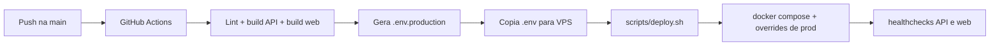

# Deploy e Operacao

## Objetivo deste capitulo

Este capitulo descreve como o projeto esta preparado para deploy e operacao em
producao, com foco no fluxo atual baseado em Docker Compose, GitHub Actions,
VPS e Nginx.

## Visao geral do deploy

O deploy de producao foi desenhado para funcionar assim:

1. push na branch `main`;
2. GitHub Actions roda CI;
3. workflow gera `.env` de producao;
4. workflow envia configuracao para a VPS;
5. script remoto atualiza o codigo e sobe os containers;
6. healthchecks validam API e web.



## Workflow GitHub Actions

O workflow principal esta em:

```text
.github/workflows/deploy.yml
```

### Gatilhos

- `push` para `main`
- `workflow_dispatch`

### Etapas de CI

Antes do deploy, o pipeline executa:

- `npm ci`
- `npm run lint`
- `npm run build`
- `npm run build:web`

Isso ajuda a impedir deploy de codigo quebrado logo na etapa de integracao.

## Geracao do `.env` de producao

O workflow monta um `.env.production` temporario com variaveis como:

- `OPENROUTER_API_KEY`
- `OPENROUTER_DEFAULT_MODEL`
- `EXTERNAL_RETRY_ATTEMPTS`
- `EXTERNAL_RETRY_BASE_DELAY_MS`
- `GITHUB_TOKEN`
- `JIRA_BASE_URL`
- `JIRA_EMAIL`
- `JIRA_API_TOKEN`
- `LANGSMITH_TRACING`
- `LANGSMITH_API_KEY`
- `WEBHOOK_CALLBACK_URL`
- `API_PORT_MAP`
- `WEB_PORT_MAP`

Esse arquivo e enviado para a VPS e copiado como `.env` do projeto.

## Docker Compose em producao

O deploy usa:

- `docker-compose.yml`
- `docker-compose.prod.yml`

O compose base define a estrutura geral dos servicos. O override de producao
ajusta principalmente:

- secrets e envs reais;
- portas bindadas em `127.0.0.1`;
- configuracao de banco em producao;
- `NEXT_PUBLIC_API_BASE_URL` para o dominio esperado.

## Servicos principais

### `postgres`

Banco relacional do projeto.

### `api`

Servico Fastify com Prisma, fluxos de IA, Swagger e endpoints administrativos.

### `web`

Painel Next.js consumindo a API ja publicada.

## Script remoto de deploy

O orquestrador remoto esta em:

```text
scripts/deploy.sh
```

### Responsabilidades do script

- entrar no diretorio de deploy;
- fazer `git fetch`, `checkout` e `pull`;
- instalar configs de Nginx se necessario;
- recarregar Nginx;
- executar `docker compose up -d --build --remove-orphans`;
- esperar o banco;
- validar healthchecks da API e da web.

## Healthchecks de producao

O script usa:

- API: `http://127.0.0.1:3020/docs`
- Web: `http://127.0.0.1:3021`

Isso prova que os servicos subiram localmente na VPS antes da exposicao via
Nginx.

## Nginx

O deploy assume arquivos de configuracao em:

```text
deploy/nginx/
```

No primeiro deploy, o script copia configs para:

- `/etc/nginx/sites-available`
- `/etc/nginx/sites-enabled`

Depois valida com `nginx -t` e recarrega o servico.

## Segredos e variaveis esperadas

### Secrets do GitHub Actions

Os principais secrets/vars usados no deploy sao:

- `VPS_SSH_KEY`
- `VPS_HOST`
- `VPS_PORT`
- `VPS_USER`
- `OPENROUTER_API_KEY`
- `OPENROUTER_DEFAULT_MODEL`
- `EXTERNAL_RETRY_ATTEMPTS`
- `EXTERNAL_RETRY_BASE_DELAY_MS`
- `GH_PAT`
- `JIRA_BASE_URL`
- `JIRA_EMAIL`
- `JIRA_API_TOKEN`
- `LANGSMITH_TRACING`
- `LANGSMITH_API_KEY`
- `WEBHOOK_CALLBACK_URL`

### Variaveis de infraestrutura

- `DEPLOY_PATH`
- `REPO_URL`

## Comportamento esperado do deploy

Quando o fluxo esta correto:

1. o workflow valida build;
2. o servidor recebe a nova `.env`;
3. o repositorio remoto e atualizado na VPS;
4. os containers sao rebuildados;
5. healthchecks ficam verdes;
6. o ambiente publicado passa a servir a nova versao.

## Operacao no dia a dia

As operacoes mais comuns em producao tendem a ser:

- acompanhar logs dos containers;
- validar healthcheck;
- revisar erro de integracao externa;
- confirmar se prompts/modelos no banco batem com o esperado;
- acompanhar custo e tokens via historico e analytics.

## Logs uteis em ambiente remoto

No host da VPS, comandos uteis incluem:

```bash
docker compose -f docker-compose.yml -f docker-compose.prod.yml logs -f api
docker compose -f docker-compose.yml -f docker-compose.prod.yml logs -f web
docker compose -f docker-compose.yml -f docker-compose.prod.yml logs -f postgres
```

## Pontos de atencao operacionais

- `OPENROUTER_API_KEY` ausente ou invalida interrompe os fluxos com LLM;
- `GH_PAT` ausente pode afetar PR review e PR tests;
- `LANGSMITH_TRACING=true` sem chave util nao ajuda na observabilidade;
- `WEBHOOK_CALLBACK_URL` com erro nao quebra o fluxo principal, mas gera step
  de falha no historico;
- valores ruins de retry podem aumentar latencia em caso de erro externo.

## Recuperacao e diagnostico

Quando algo falha em producao, a ordem mais util de diagnostico costuma ser:

1. conferir execucao do workflow;
2. validar `.env` gerado;
3. revisar logs do `api`;
4. testar `GET /health` e `GET /docs`;
5. revisar conectividade com banco e OpenRouter;
6. validar Nginx e portas locais.

## Limites assumidos na operacao atual

O deploy atual foi desenhado para o case e, por isso, assume:

- uma VPS unica;
- deploy por Docker Compose;
- ausencia de orquestrador como Kubernetes;
- observabilidade operacional relativamente simples;
- rollout direto, sem estrategia blue/green.

Esses limites sao coerentes com o escopo da entrega e deixam a operacao mais
facil de entender.

## Relacao com os proximos capitulos

Depois deste capitulo, a leitura natural e:

- `12-testes-validacao.md`
- `14-troubleshooting-faq.md`
